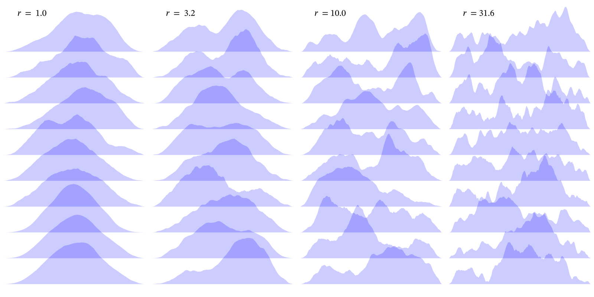

# StochasticSTF

<address><a href="https://interfacial.jp/">Shiro Hirano</a></address>

## Summary

In fortran90+, julia, matlab, and python code, 
```
x = StochasticSTF(n)
```
returns a stochastic Source Time Function (STF) of length `n` that satisfies the following properties:
+ The STF starts from and terminates at zero (i.e., `x(1) = x(n) = 0`).
+ The STF amplitude is non-negative.
+ The Fourier amplitude spectrum follows $\omega^{-2}$-model.
+ The moment function $M_0(t) = \displaystyle\int_0^t \textrm{STF}(s) \ ds$ is propotional to $t^3$.

Running
```
x = StochasticSTF(n, r)
```
with a floating-point number `r` $(> 1.0)$ results in more complicated STFs as in the following figure.



## Arguments and behavior

The function `StochasticSTF(n,r,d)` returns a stochastic Source Time Function (STF) of length `n`, where `r` and `d` are optional paramters.
The floating-point number `r` $(\ge 1.0)$ is the ratio of two corner frequencies and determines roughness of the STF, where the default value (`r=1.0`) results in STF with the $\omega^{-2}$-type spectrum, and STFs get rougher as `r` increases.
Integer `d` $(\ge 2)$, dimension of the Bessel bridge, is optional; the default value is `d=2`, and STFs get smoother as `d` increases.
The result is normalized so that `sum(STF) = 1.0` holds.
The algorithm has been modified after Hirano(2022; 2023).
This code generates STFs with arbitrary lengths by using Bessel bridges, while the original model has probabilistic lengths following the Gutenberg-Richter law.

## References
+ Hirano, S. (2022), "Source time functions of earthquakes based on a stochastic differential equation", Scientific Reports, 12:3936, [https://doi.org/10.1038/s41598-022-07873-2](https://doi.org/10.1038/s41598-022-07873-2)
+ Hirano, S. (2023), "Stochastic source time functions with double corner frequencies", AGU23 Fall Meeting, S13F-0407, [https://agu.confex.com/agu/fm23/meetingapp.cgi/Paper/1299761](https://agu.confex.com/agu/fm23/meetingapp.cgi/Paper/1299761)


## Fortran90+: Usage and Compilation

Simply after compiling `m_stochasticSTF.f90`, the function `StochasticSTF(n,r)` will be callable.

For example, 
```bash
gfortran m_stochasticSTF.f90 main.f90
./a.out
```
results in `STF.svg`, and the second column therein is the amplitude of a stochastic source time function. 
Ignore the first and last line of the file to get numerics.
See comments in the source codes for usage.

To specity precision, see the comments in `m_stochasticSTF.f90`.

## Julia, Matlab, python: Usage

Running `main.jl`, `main.m`, or `main.py` calculates and plots a stochastic STF.

LinearAlgebra, DSP, and Plots are required for julia.
